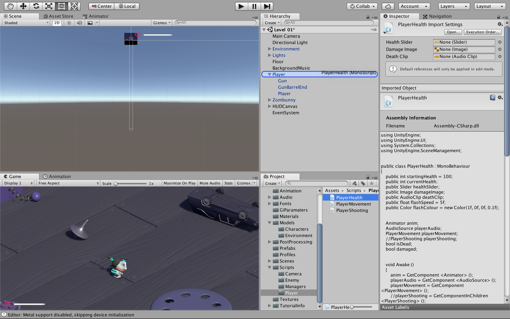

# プレイヤーの体力
### ここでは，前回作った体力のUIをプレイヤーと紐づけます
"Assets > Script > Player" のフォルダから "PlayerHealth" を "Player" にドロップ


"PlayerHealth" を確認する
```
using UnityEngine;
using UnityEngine.UI;
using System.Collections;
using UnityEngine.SceneManagement;


public class PlayerHealth : MonoBehaviour {

  // 変数の宣言
  public int startingHealth = 100;
  public int currentHealth;
  public Slider healthSlider;
  public Image damageImage;
  public AudioClip deathClip;
  public float flashSpeed = 5f;
  public Color flashColour = new Color(1f, 0f, 0f, 0.1f);


  Animator anim;
  AudioSource playerAudio;
  PlayerMovement playerMovement;
  // PlayerShooting playerShooting;
  bool isDead;
  bool damaged;

  // ゲームが始まる前に変数を初期化
  void Awake () {
    anim = GetComponent <Animator> ();
    playerAudio = GetComponent <AudioSource> ();
    playerMovement = GetComponent <PlayerMovement> ();
    // playerShooting = GetComponentInChildren <PlayerShooting> ();
    currentHealth = startingHealth;
  }

  // フレーム毎に変数を更新
  void Update () {
    /*
     * プレイヤーがダメージを受けると，
     * damageImageのcolor を flashColour に変更する
     * ダメージを受けていなければ，
     * damageImage.colorからRGBA(0,0,0,0)に変化させる
     */
    if(damaged) {
      damageImage.color = flashColour;
    }
    else {
      damageImage.color = Color.Lerp (damageImage.color, Color.clear, flashSpeed * Time.deltaTime);
    }
    damaged = false;
  }

  // プレイヤーがダメージを受けた時の処理
  public void TakeDamage (int amount) {
    damaged = true;
    
    // プレイヤーの体力を減らす
    currentHealth -= amount;

    // 体力ゲージの値を更新
    healthSlider.value = currentHealth;

    // ダメージを受けた時の効果音を再生
    playerAudio.Play ();

    // プレイヤーが死亡状態になっておらず，プレイヤーの体力が0以下ならば，Death を呼び出す
    if(currentHealth <= 0 && !isDead) {
      Death ();
    }
  }

  // プレイヤーの体力が0になった時の処理
  void Death () {
    isDead = true;

    // プライヤーの "Gun" を無効にする
    // playerShooting.DisableEffects ();

    // プレイヤーの死亡した時のアニメーションを開始する
    anim.SetTrigger ("Die");

    // プレイヤーが死亡した時の効果音を再生
    playerAudio.clip = deathClip;
    playerAudio.Play ();

    // playerMovement と　playerShooting を無効にする
    // playerMovement.enabled = false;
    // playerShooting.enabled = false;
  }

  // リスタート
  public void RestartLevel () {
    SceneManager.LoadScene (0);
  }
}
```
"Player" を選択し，"Player Health (Script)" の "Health Slider" の部分に "HealthSlider" をドロップする


同様に "DamageImage" をドロップ


"Death Clip" には "Player Death" を入れる


"Assets > Script > Enemy" のフォルダから "EnemyAttack" を "Zombunny" にドロップ


"EnemyAttack" を確認する
```
using UnityEngine;
using System.Collections;

public class EnemyAttack : MonoBehaviour {

  // 変数の宣言
  public float timeBetweenAttacks = 0.5f;
  public int attackDamage = 10;


  Animator anim;
  GameObject player;
  PlayerHealth playerHealth;
  // EnemyHealth enemyHealth;
  bool playerInRange;
  float timer;

  // ゲームが始まる前に変数を初期化
  void Awake () {
    player = GameObject.FindGameObjectWithTag ("Player");
    playerHealth = player.GetComponent <PlayerHealth> ();
    // enemyHealth = GetComponent<EnemyHealth>();
    anim = GetComponent <Animator> ();
  }

  // 敵のColliderコンポーネントにオブジェクトが触れた時の処理
  void OnTriggerEnter (Collider other) {
    /* 
     * 衝突したオブジェクトを引数として受け取り，
     * それがプレイヤーならば，playerInRange を true にする
     */
    if(other.gameObject == player) {
      playerInRange = true;
    }
  }

  //　敵のColliderコンポーネントにオブジェクトが触れるのをやめた時の処理
  void OnTriggerExit (Collider other) {
    /* 
     * 衝突したオブジェクトを引数として受け取り，
     * それがプレイヤーならば，playerInRange を false にする
     */
    if(other.gameObject == player) {
      playerInRange = false;
    }
  }

  // フレーム毎に変数を更新
  void Update () {
    timer += Time.deltaTime;
    /* 
     * プライヤーが当たり判定範囲内に入っていて，なおかつ敵の体力が0より大きいときに
     * Attack を呼び出す
     * この時，攻撃を連続的に受けないように timer が timeBetweenAttacks を超えるまで
     * Attack は呼び出されない
     */
    if(timer >= timeBetweenAttacks && playerInRange /*&& enemyHealth.currentHealth > 0*/) {
      Attack ();
    }

    // プレイヤーの体力が0以下になった時，敵のアニメーションを "Idle" 状態にする
    if(playerHealth.currentHealth <= 0) {
      anim.SetTrigger ("PlayerDead");
    }
  }

  // 攻撃
  void Attack () {
    // timer をリセット
    timer = 0f;

    /* 
     * プレイヤーの体力が0より大きければ，
     * playerHealth 内の TakeDamage を呼び出す
     */ 
    if(playerHealth.currentHealth > 0) {
      playerHealth.TakeDamage (attackDamage);
    }
  }
}

```

テストプレイをしてみる<br>
敵に触れるとダメージを受け，体力が無くなった時にプレイヤーが死ぬようになれば問題ない
