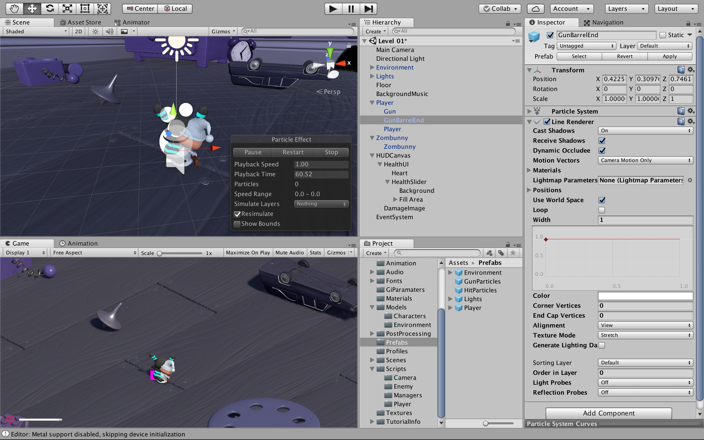

# プレイヤーの攻撃
### ここでは，プレイヤーから敵に対しての攻撃を実装する
"Assets> Scripts > Enemy" のフォルダ内の "EnemyHealth" を "Zombunny" へドロップ


"EnemyHealth" を確認する
```
using UnityEngine;

public class EnemyHealth : MonoBehaviour {
  
  // 変数の宣言
  public int startingHealth = 100;
  public int currentHealth;
  public float sinkSpeed = 2.5f;
  public int scoreValue = 10;
  public AudioClip deathClip;


  Animator anim;
  AudioSource enemyAudio;
  ParticleSystem hitParticles;
  CapsuleCollider capsuleCollider;
  bool isDead;
  bool isSinking;

  // ゲームが始まる前に変数を初期化する
  void Awake () {
    anim = GetComponent <Animator> ();
    enemyAudio = GetComponent <AudioSource> ();
    hitParticles = GetComponentInChildren <ParticleSystem> ();
    capsuleCollider = GetComponent <CapsuleCollider> ();

    currentHealth = startingHealth;
  }

  /* 
   * フレーム毎に isSinking を評価し，
   * true ならば，そのオブジェクトをy軸の負の方向に移動させる
   * つまりオブジェクトを沈ませる
   */ 
  void Update () {
    if(isSinking) {
      transform.Translate (-Vector3.up * sinkSpeed * Time.deltaTime);
    }
  }

  // 敵がダメージを受けた時の処理
  public void TakeDamage (int amount, Vector3 hitPoint) {
    // すでに死んでいるなら何もしない
    if (isDead) {
      return;
    }

    // ダメージを受けた時の効果音を再生
    enemyAudio.Play ();

    // 体力を減らす
    currentHealth -= amount;
      
    // プレイヤーの攻撃が当たった部分にヒットエフェクトが出るようにする
    hitParticles.transform.position = hitPoint;
    hitParticles.Play();

    // 体力が0以下になったら，Death を呼び出す
    if(currentHealth <= 0) {
      Death ();
    }
  }

  // 敵の体力が0になった時の処理
  void Death () {
    isDead = true;

    capsuleCollider.isTrigger = true;

    // 敵が死亡した時のアニメーションを起動させる
    anim.SetTrigger ("Dead");

    // 敵が死亡した時の効果音を再生
    enemyAudio.clip = deathClip;
    enemyAudio.Play ();
  }

  // 死んだ敵をフィールドから消す処理
  public void StartSinking () {
    // NavMeshAgent を無効にする
    GetComponent <UnityEngine.AI.NavMeshAgent> ().enabled = false;

    // 物理演算の影響を受けるようにする
    GetComponent <Rigidbody> ().isKinematic = true;

    // true にすることで update で沈みこませる
    isSinking = true;
    // ScoreManager.score += scoreValue;

    // オブジェクトの削除
    Destroy (gameObject, 2f);
  }
}
```
"Zombunny" を選択し，"Enemy Health (Script)" 内の "Death Clip" を　"Zombunny Death" にする


"Assets > Script > Enmey" 内の "EnemyAttack" をダブルクリックでエディタを起動


"EnemyAttack"の14行目，22行目，57行目のコメントアウトになっている部分を外す<br>
コードは以下のようになる
```
using UnityEngine;
using System.Collections;

public class EnemyAttack : MonoBehaviour {

  // 変数の宣言
  public float timeBetweenAttacks = 0.5f;
  public int attackDamage = 10;


  Animator anim;
  GameObject player;
  PlayerHealth playerHealth;
  EnemyHealth enemyHealth;
  bool playerInRange;
  float timer;

  // ゲームが始まる前に変数を初期化
  void Awake () {
    player = GameObject.FindGameObjectWithTag ("Player");
    playerHealth = player.GetComponent <PlayerHealth> ();
    enemyHealth = GetComponent<EnemyHealth>();
    anim = GetComponent <Animator> ();
  }

  // 敵のColliderコンポーネントにオブジェクトが触れた時の処理
  void OnTriggerEnter (Collider other) {
    /* 
     * 衝突したオブジェクトを引数として受け取り，
     * それがプレイヤーならば，playerInRange を true にする
     */
    if(other.gameObject == player) {
      playerInRange = true;
    }
  }

  //　敵のColliderコンポーネントにオブジェクトが触れるのをやめた時の処理
  void OnTriggerExit (Collider other) {
    /* 
     * 衝突したオブジェクトを引数として受け取り，
     * それがプレイヤーならば，playerInRange を false にする
     */
    if(other.gameObject == player) {
      playerInRange = false;
    }
  }

  // フレーム毎に変数を更新
  void Update () {
    timer += Time.deltaTime;
    /* 
     * プライヤーが当たり判定範囲内に入っていて，なおかつ敵の体力が0より大きいときに
     * Attack を呼び出す
     * この時，攻撃を連続的に受けないように timer が timeBetweenAttacks を超えるまで
     * Attack は呼び出されない
     */
    if(timer >= timeBetweenAttacks && playerInRange && enemyHealth.currentHealth > 0) {
      Attack ();
    }

    // プレイヤーの体力が0以下になった時，敵のアニメーションを "Idle" 状態にする
    if(playerHealth.currentHealth <= 0) {
      anim.SetTrigger ("PlayerDead");
    }
  }

  // 攻撃
  void Attack () {
    // timer をリセット
    timer = 0f;

    /* 
     * プレイヤーの体力が0より大きければ，
     * playerHealth 内の TakeDamage を呼び出す
     */ 
    if(playerHealth.currentHealth > 0) {
      playerHealth.TakeDamage (attackDamage);
    }
  }
}
```

"Assets > Prefabs" 内の "GunParticles" を選択


"Inspector" 内の "Particle System" を "Copy Component" でコピーする<br>
"Particle System" についての詳細は以下のリンクへ
### [Particle System](https://docs.unity3d.com/ja/2017.3/Manual/class-ParticleSystem.html)


"Player > GunBarrelEnd" に "Paste Component As New" で先ほどコピーしたコンポーネントを貼り付け


"GunBarrelEnd" に "Add Component" で "Line Renderer" を追加<br>
"Line Renderer" についての詳細は以下のリンクへ
### [Line Renderer](https://docs.unity3d.com/ja/2017.3/Manual/class-LineRenderer.html)


"Materials" の "Element 0" を "LineRenderMaterial" に設定


"Width" を "0.05" に変更する


"Line Renderer" のチェックを外す


"Light" を追加し，以下のように設定する<br>
"Color" を黄色にし，"Light" のチェックを外す


同様に，"Audio Source" を追加し，以下のようにする<br>
"AudioClip" には "Player GunShot" を入れ，"Play On Awake" のチェックを外す


"Assets > Script > Player" フォルダ内から "PlayerShooting" を "GunBarrelEnd" にドロップ


"PlayerShooting" を確認する
```
using UnityEngine;

public class PlayerShooting : MonoBehaviour {
  
  // 変数の宣言
  public int damagePerShot = 20;

  // 攻撃のインターバル
  public float timeBetweenBullets = 0.15f;
  public float range = 100f;


  float timer;
  Ray shootRay = new Ray();
  RaycastHit shootHit;
  int shootableMask;
  ParticleSystem gunParticles;
  LineRenderer gunLine;
  AudioSource gunAudio;
  Light gunLight;
  float effectsDisplayTime = 0.2f;

  // ゲームが始まる前に変数の初期化
  void Awake () {
    shootableMask = LayerMask.GetMask ("Shootable");
    gunParticles = GetComponent<ParticleSystem> ();
    gunLine = GetComponent <LineRenderer> ();
    gunAudio = GetComponent<AudioSource> ();
    gunLight = GetComponent<Light> ();
  }

  // フレーム毎に
  void Update () {
    timer += Time.deltaTime;

    /* 
     * 攻撃の入力があり，
     * Timeが攻撃のインターバルを超えていてかつ，時間経過が0でない時
     * Shoot を呼び出す
     */ 
    if(Input.GetButton ("Fire1") && timer >= timeBetweenBullets && Time.timeScale != 0) {
          Shoot ();
    }

    // インターバルを超えていれば，DisableEffects を呼び出す
    if(timer >= timeBetweenBullets * effectsDisplayTime) {
      DisableEffects ();
    }
  }

  // gunを無効にする処理
  public void DisableEffects () {
    gunLine.enabled = false;
    gunLight.enabled = false;
  }

  // プレイヤーの攻撃
  void Shoot () {
    // 時間をリセット
    timer = 0f;

    // 攻撃の効果音を再生
    gunAudio.Play ();

    // gunLight を有効にする
    gunLight.enabled = true;

    // 攻撃エフェクトを停止し，エフェクトのアニメーションをスタート位置に戻す
    gunParticles.Stop ();

    // 攻撃エフェクトの再生
    gunParticles.Play ();

    // gunLine を有効にする
    gunLine.enabled = true;

    // gunLineの位置をオブジェクトの位置にする
    gunLine.SetPosition (0, transform.position);

    // Rayの原点をオブジェクトの位置にする
    shootRay.origin = transform.position;

    // Rayの方向をオブジェクトの前方向にする
    shootRay.direction = transform.forward;

    // 攻撃が当たった時の処理
    if(Physics.Raycast (shootRay, out shootHit, range, shootableMask)) {
    
      // 攻撃が当たった敵の体力を取得する
      EnemyHealth enemyHealth = shootHit.collider.GetComponent <EnemyHealth> ();

      // 敵に体力があるならば，enemyHealth の TakeDamege を呼び出す
      if(enemyHealth != null) {
        enemyHealth.TakeDamage (damagePerShot, shootHit.point);
      }

      // Line の位置を攻撃が当たった位置にする
      gunLine.SetPosition (1, shootHit.point);
    }
    // 攻撃が当たらなかった時の処理
    else {
      // 攻撃限界範囲 range まで Ray の原点から gunLine を移動させる 
      gunLine.SetPosition (1, shootRay.origin + shootRay.direction * range);
    }
  }
}
```
"Ray"，"Physics.Raycast"，"Input"，"Time.timeScale" についての詳細は以下のリンクへ
### [Ray](https://docs.unity3d.com/ja/current/ScriptReference/Ray.html)
### [Input](https://docs.unity3d.com/ja/current/ScriptReference/Input.html)
### [Time.timeScale](https://docs.unity3d.com/ja/current/ScriptReference/Time-timeScale.html)
### [Physics.Raycast](https://docs.unity3d.com/ja/current/ScriptReference/Physics.Raycast.html)
"Hierarchy" 内の "Player" を選択し，<br>
"Inspector" 内の "Apply" をクリックし，プレハブを反映させる


"Assets > Script > Enemy" フォルダ内の "EnemyMovement" をエディタで開き，コメントアウトされている部分を全て解除する<br>
コードは以下のようになる<br>
```
using UnityEngine;
using System.Collections;

public class EnemyMovement : MonoBehaviour {
  // 変数の宣言
  Transform player;
  PlayerHealth playerHealth;
  EnemyHealth enemyHealth;
  UnityEngine.AI.NavMeshAgent nav;

  // ゲームが始まる前に変数を初期化
  void Awake () {
    /*
     * player という変数にゲームオブジェクトの "Player" の "transform" を入れる
     * "transform" はそのゲームオブジェクトの位置，回転，スケールを扱うことができる
     */
    player = GameObject.FindGameObjectWithTag ("Player").transform;

    // playerHealth という変数にゲームオブジェクト "Player" の "PlayerHealth" を入れる
    playerHealth = player.GetComponent <PlayerHealth> ();

    // enmeyHealth という変数にコンポーネント "enemyHealth" を入れる
    enemyHealth = GetComponent <EnemyHealth> ();

    // nav という変数にコンポーネント "NavMeshAgent" を入れる
    nav = GetComponent <UnityEngine.AI.NavMeshAgent> ();
  }

  /*
   * Update はフレーム毎に呼び出される
   * ここでは変数の更新のために使用
   */
  void Update () {
    /* 
     * 敵とプレイヤーの体力がどちらも0より大きいのであれば，
     * 敵が向かう座標をプレイヤーがいる位置に設定する
     * それ以外であれば，コンポーネントを無効にして更新をやめる
     */
    if(enemyHealth.currentHealth > 0 && playerHealth.currentHealth > 0) {
      nav.SetDestination (player.position);
    }
    else {
      nav.enabled = false;
    }
  }
}
```

同様に，"Assets > Script Player" フォルダ内の "PlayerHealth" のコメントアウトの部分を全て解除する<br>
コードは以下のようになる
```
using UnityEngine;
using UnityEngine.UI;
using System.Collections;
using UnityEngine.SceneManagement;


public class PlayerHealth : MonoBehaviour {

  // 変数の宣言
  public int startingHealth = 100;
  public int currentHealth;
  public Slider healthSlider;
  public Image damageImage;
  public AudioClip deathClip;
  public float flashSpeed = 5f;
  public Color flashColour = new Color(1f, 0f, 0f, 0.1f);


  Animator anim;
  AudioSource playerAudio;
  PlayerMovement playerMovement;
  // PlayerShooting playerShooting;
  bool isDead;
  bool damaged;

  // ゲームが始まる前に変数を初期化
  void Awake () {
    anim = GetComponent <Animator> ();
    playerAudio = GetComponent <AudioSource> ();
    playerMovement = GetComponent <PlayerMovement> ();
    // playerShooting = GetComponentInChildren <PlayerShooting> ();
    currentHealth = startingHealth;
  }

  // フレーム毎に変数を更新
  void Update () {
    /*
     * プレイヤーがダメージを受けると，
     * damageImageのcolor を flashColour に変更する
     * ダメージを受けていなければ，
     * damageImage.colorからRGBA(0,0,0,0)に変化させる
     */
    if(damaged) {
      damageImage.color = flashColour;
    }
    else {
      damageImage.color = Color.Lerp (damageImage.color, Color.clear, flashSpeed * Time.deltaTime);
    }
    damaged = false;
  }

  // プレイヤーがダメージを受けた時の処理
  public void TakeDamage (int amount) {
    damaged = true;
    
    // プレイヤーの体力を減らす
    currentHealth -= amount;

    // 体力ゲージの値を更新
    healthSlider.value = currentHealth;

    // ダメージを受けた時の効果音を再生
    playerAudio.Play ();

    // プレイヤーが死亡状態になっておらず，プレイヤーの体力が0以下ならば，Death を呼び出す
    if(currentHealth <= 0 && !isDead) {
      Death ();
    }
  }

  // プレイヤーの体力が0になった時の処理
  void Death () {
    isDead = true;

    // プライヤーの "Gun" を無効にする
    // playerShooting.DisableEffects ();

    // プレイヤーの死亡した時のアニメーションを開始する
    anim.SetTrigger ("Die");

    // プレイヤーが死亡した時の効果音を再生
    playerAudio.clip = deathClip;
    playerAudio.Play ();

    // playerMovement と　playerShooting を無効にする
    // playerMovement.enabled = false;
    // playerShooting.enabled = false;
  }

  // リスタート
  public void RestartLevel () {
    SceneManager.LoadScene (0);
  }
}
```

"Assets > Prefabs" フォルダの中から "HitParticles" を "Zombunny" にドロップ


スクリプトを保存し，テストプレイをする<br>
クリックで発砲し，敵を倒すことができれば問題ない

