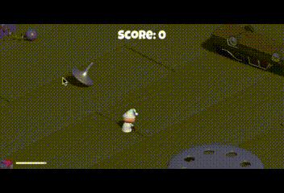

# Survival Shooter Tutorial
Unityというゲームエンジンを用いて，簡単な3Dシューティングゲームを作ります

Unityでは，2Dゲームはもちろん3Dゲームも手軽に開発することができます 
また，Unityは様々なプラットフォームに対応したゲームを作成することができます 
（例えば，iOS，Android，Windows，Mac）

以下のものをこれから作っていきます 
[Survival Shooter Tutorial](https://unity3d.com/jp/learn/tutorials/s/survival-shooter-tutorial)

