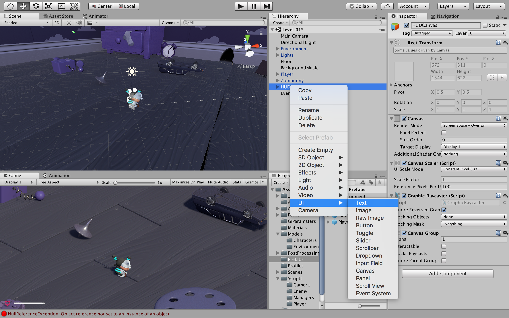
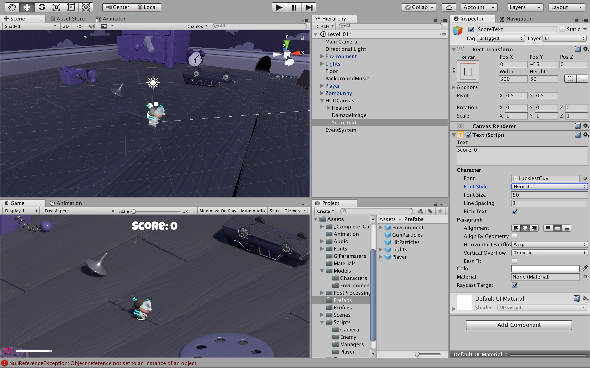
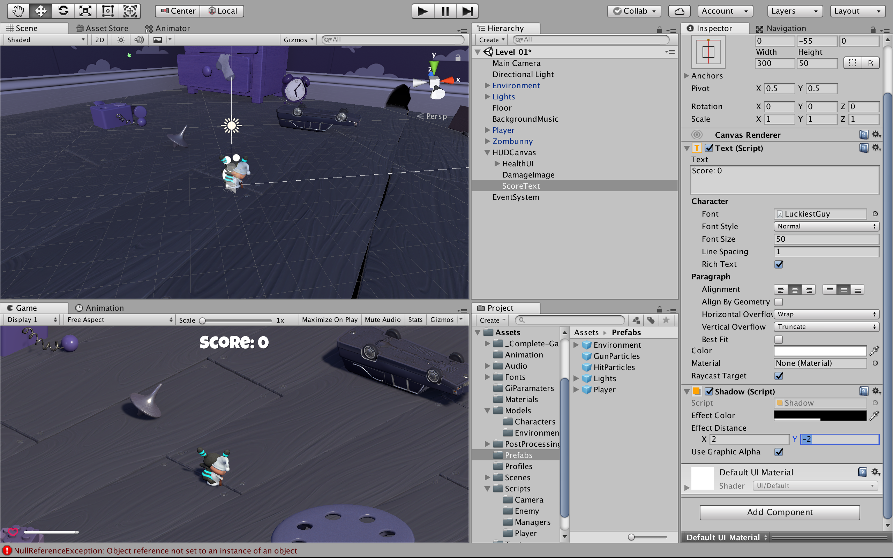
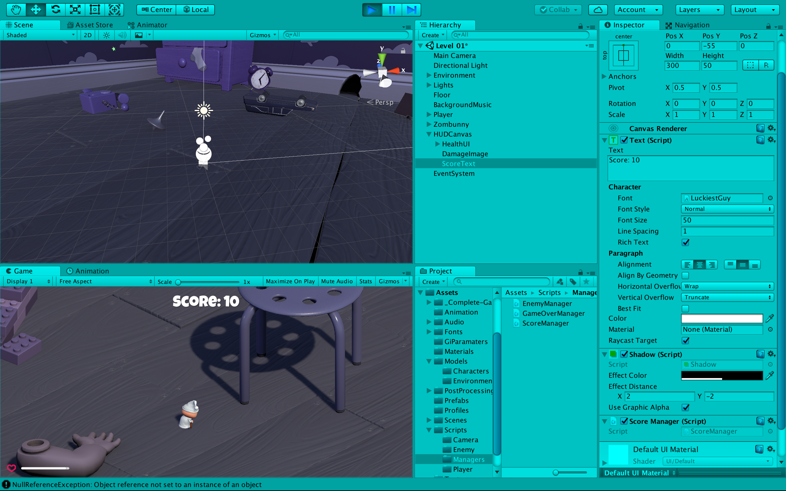
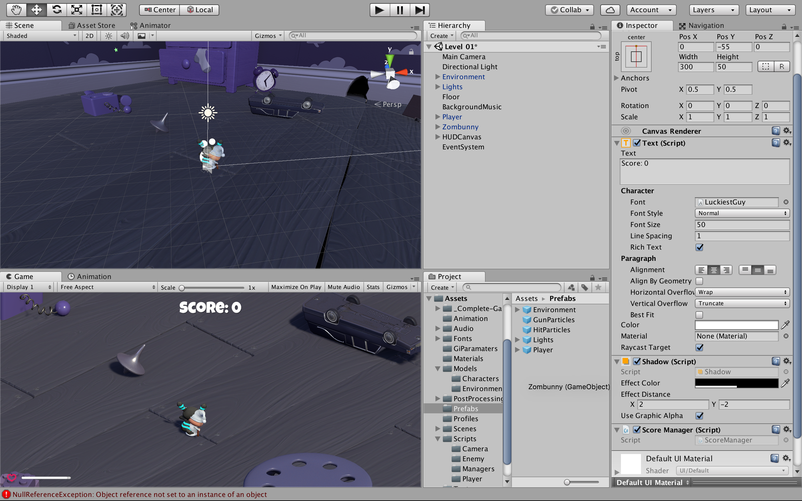
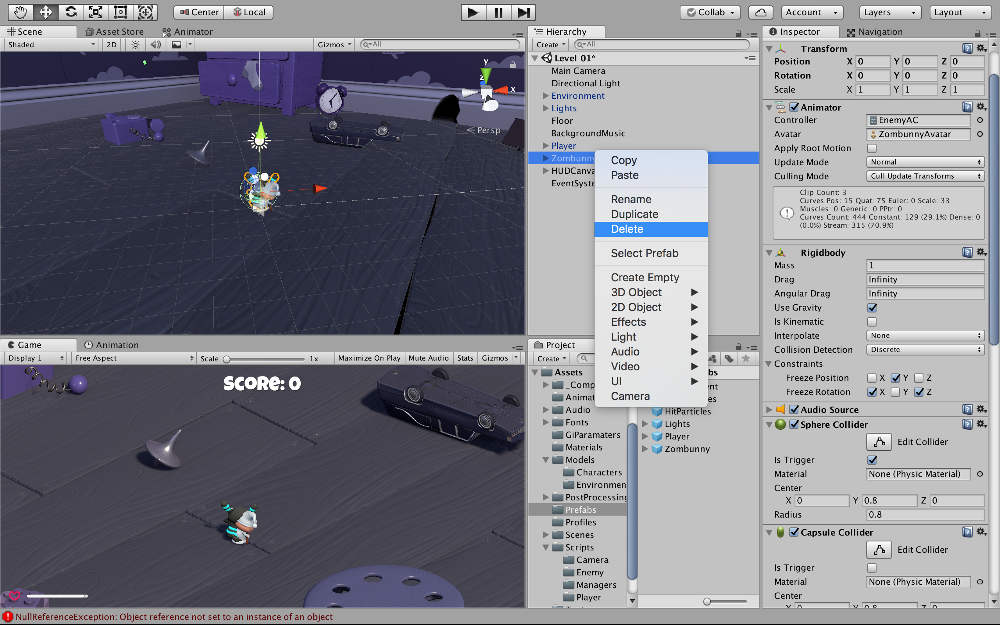

# スコアポイントの表示
### ここでは，スコアポイントを表示できるようにする
"HUDCanvas" で右クリックし，"UI > Text" を選択<br>
"Text" についての詳細は以下のリンクへ
### [Text](https://docs.unity3d.com/ja/2017.3/Manual/script-Text.html)


"Text" の名前を "ScoreText" に変更し，<br>
"React Transform" の "Anchor Presets" を上中央のものにする<br>
"PosY" を "-55"<br>
"Width" を "300"，"Height" を "50"<br>
"Text" を "Score: 0"<br>
"Font" を "LuckiestGuy"<br>
"Font Size" を "50"<br>
"Alignment" を 左右上下中央にする<br>
"Color" を白にする<br>


"Add Component" で "Shadow" を追加<br>
以下のように設定する<br>
"Shadow" についての詳細は以下のリンクへ
### [Shadow](https://docs.unity3d.com/ja/2017.3/Manual/script-Shadow.html)


"Assets > Scripts > Manager" フォルダ内の "ScoreManager" を "ScoreText" にドロップ


"ScoreManager" を確認する
```
using UnityEngine;
using UnityEngine.UI;
using System.Collections;

public class ScoreManager : MonoBehaviour {

  // 変数の宣言
  public static int score;


  Text text;

  // ゲームが始まる前にスコアのテキストを初期化
  void Awake () {
    text = GetComponent <Text> ();
    score = 0;
  }

  // フレーム毎にスコアのテキストを更新
  void Update () {
    text.text = "Score: " + score;
  }
}
```

"Assets > Scripts > Enemy" フォルダ内の "EnemyHealth" をエディタで開く<br>
90行目のコメントアウトを解除する<br>
コードは以下のようになる
```
using UnityEngine;

public class EnemyHealth : MonoBehaviour {
  
  // 変数の宣言
  public int startingHealth = 100;
  public int currentHealth;
  public float sinkSpeed = 2.5f;
  public int scoreValue = 10;
  public AudioClip deathClip;


  Animator anim;
  AudioSource enemyAudio;
  ParticleSystem hitParticles;
  CapsuleCollider capsuleCollider;
  bool isDead;
  bool isSinking;

  // ゲームが始まる前に変数を初期化する
  void Awake () {
    anim = GetComponent <Animator> ();
    enemyAudio = GetComponent <AudioSource> ();
    hitParticles = GetComponentInChildren <ParticleSystem> ();
    capsuleCollider = GetComponent <CapsuleCollider> ();

    currentHealth = startingHealth;
  }

  /* 
   * フレーム毎に isSinking を評価し，
   * true ならば，そのオブジェクトをy軸の負の方向に移動させる
   * つまりオブジェクトを沈ませる
   */ 
  void Update () {
    if(isSinking) {
      transform.Translate (-Vector3.up * sinkSpeed * Time.deltaTime);
    }
  }

  // 敵がダメージを受けた時の処理
  public void TakeDamage (int amount, Vector3 hitPoint) {
    // すでに死んでいるなら何もしない
    if (isDead) {
      return;
    }

    // ダメージを受けた時の効果音を再生
    enemyAudio.Play ();

    // 体力を減らす
    currentHealth -= amount;
      
    // プレイヤーの攻撃が当たった部分にヒットエフェクトが出るようにする
    hitParticles.transform.position = hitPoint;
    hitParticles.Play();

    // 体力が0以下になったら，Death を呼び出す
    if(currentHealth <= 0) {
      Death ();
    }
  }

  // 敵の体力が0になった時の処理
  void Death () {
    isDead = true;

    capsuleCollider.isTrigger = true;

    // 敵が死亡した時のアニメーションを起動させる
    anim.SetTrigger ("Dead");

    // 敵が死亡した時の効果音を再生
    enemyAudio.clip = deathClip;
    enemyAudio.Play ();
  }

  // 死んだ敵をフィールドから消す処理
  public void StartSinking () {
    // NavMeshAgent を無効にする
    GetComponent <UnityEngine.AI.NavMeshAgent> ().enabled = false;

    // 物理演算の影響を受けるようにする
    GetComponent <Rigidbody> ().isKinematic = true;

    // true にすることで update で沈みこませる
    isSinking = true;

    // スコアを加算
    ScoreManager.score += scoreValue;

    // オブジェクトの削除
    Destroy (gameObject, 2f);
  }
}
```

テストプレイをする<br>
敵を倒した時，スコアポイントが増えれば問題ない


"Zombunny" を "Assets > Prefabs" にドロップし,<br>
"Zombunny" をプレハブ化する


"Hierarchy" から "Zombunny" を削除し,シーンを保存する


