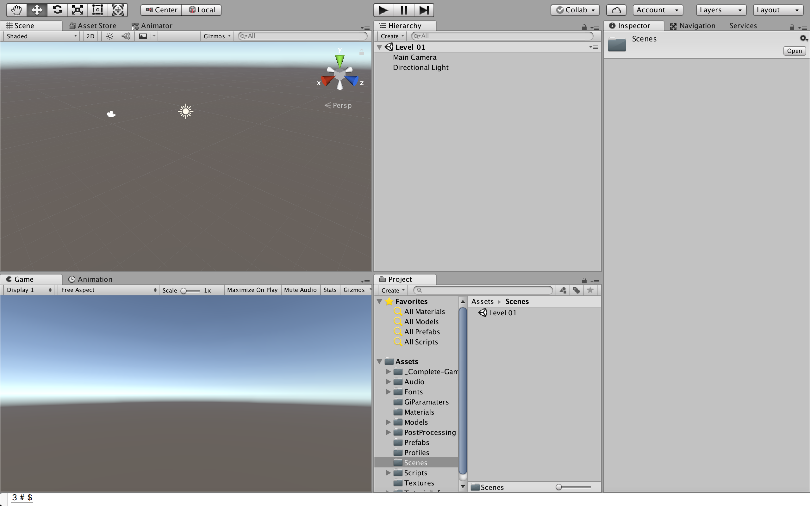

# 環境構築
### ここでは，ゲームのフィールドとBGMを実装する
## ゲームのフィールドを実装
"Scenes" というフォルダをAssets内に作成する

シーンを作成します  
"File" > "New Scene" 


"Level 01" という名前でsceneで保存します 
"File" > "Save Scene as"

"Assets > Scenes" に保存する


"Assets > Prefabs" から "Environment" を "Hierarchy" にドロップする

"Environment" をクリックし， 
"Inspector" 内の "Transform" のPositionを  
"x : 0, y : 0, z : 0" にする

同じ手順をPrefabs内の "Lights" にも行う

"GameObject > 3D Object > Quad" で "Quad" を作成

名前を "Floor" に変更する 
Transformの値を以下のように設定する

"Mesh Renderer" を "Remove Component" で削除する

"layer" を "Floor" に変更する


## BGMを実装
"GameObject > Create Empty" で GameObjectを生成

"backgroundMusic" に名前を変更

"Inspector" から "Add Component" で "Audio Source" を追加

"Audio Source" 内の "AudioClip" の入力欄の右にあるボタンを押し， 
表示されたAudioの中から "Background Music" を選択

"Audio Source" 内の "Loop" にチェックを入れる
