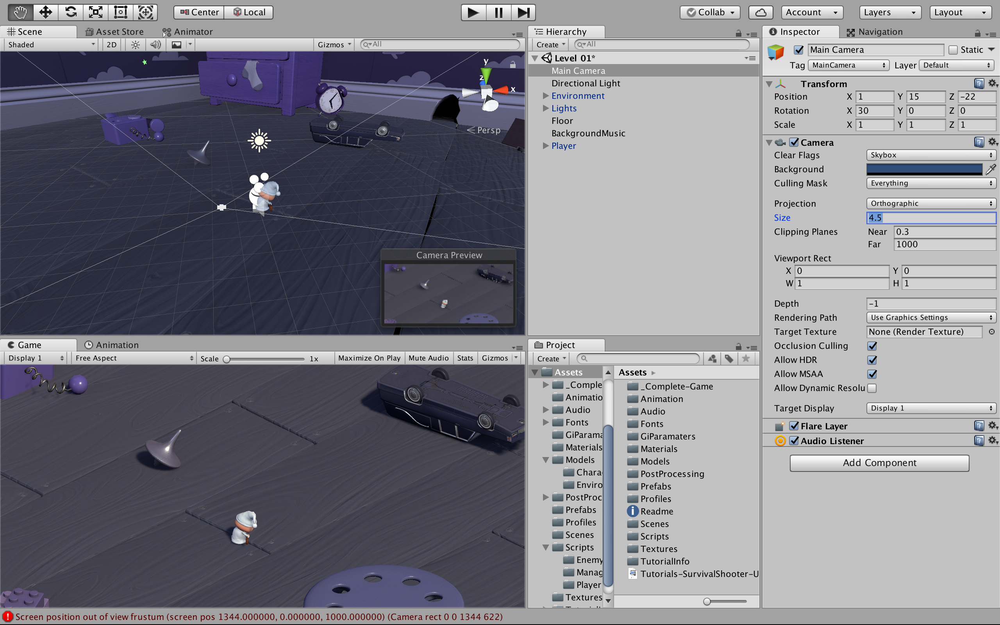
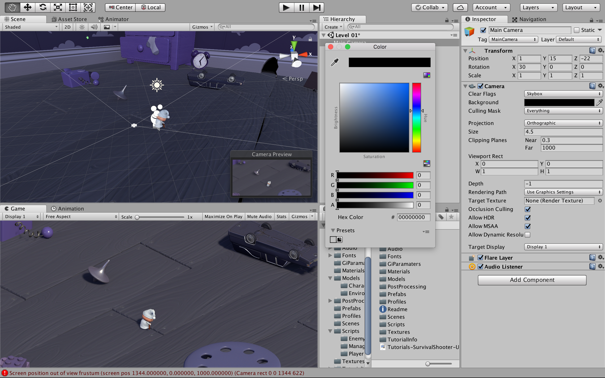
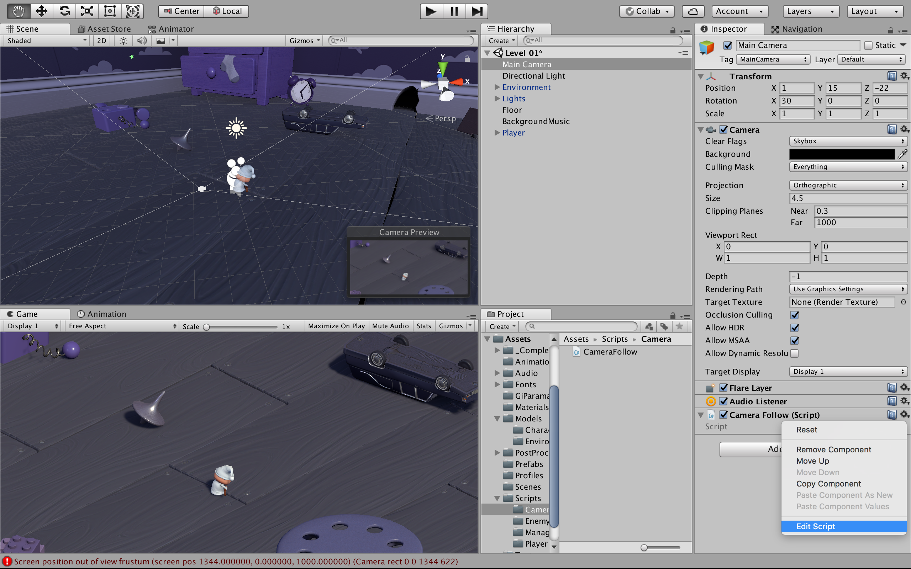

# カメラの実装
### ここでは，プレイヤーの動きに合わせて追従するカメラを実装する

"Hierarchy" 内の "Main Camera" を選択し，以下のように値を設定する


"Background" を黒に変更


"Assets > Scripts" に "Camera" フォルダを作成


"Camera" フォルダ内で "Create > C# Script"


作ったスクリプトファイルを "CameraFollow" に名前変更


"CameraFollow" を "Hierarchy" 内の "Main Camera" にドロップする


"Main Camera" を選択しする<br>
"Inspector" 内の "CameraFollow(Script)" の右にある歯車のアイコンをクリックし，<br>
"Edit Script" でエディタ起動


"CameraFollow" 内の "Start" メソッドと "Update" メソッドを削除し，<br>
以下の状態にする
```
using System.Collections;
using System.Collections.Generic;
using UnityEngine;

public class CameraFollow : MonoBehaviour {

}
```

変数を追加する
```
public Transform target;
public float smoothing = 5f;
```

プライベート変数を追加
```
Vector3 offset;
```

"Start" を追加する<br>
"Start" メソッドはゲームが始まる前に一回呼ばれる<br>
ここでは，初期のオフセットを設定するために使用<br>
"Start" についての詳細は以下のリンクへ
### [Start](https://docs.unity3d.com/jp/current/ScriptReference/MonoBehaviour.Start.html)
```
void Start () {
  // Calculate the initial offset.
  offset = transform.position - target.position;
}
```

"FixedUpdate" を追加<br>
プレイヤーが移動しても一定の距離を保ち，追従するようなカメラの位置を常に更新します<br>
"Vector3.Lerp" についての詳細は以下のリンクへ
### [Vector3.Lerp](https://docs.unity3d.com/jp/current/ScriptReference/Vector3.Lerp.html)
```
void FixedUpdate () {
  Vector3 targetCamPos = target.position + offset;

  transform.position = Vector3.Lerp (transform.position, targetCamPos, smoothing * Time.deltaTime);
}
```

スクリプトを保存し，Unityに戻る<br>
"Main Camera" を選択し，"Inspector" 内の "CameraFollow(Script)" の "Target" に "Player" をドロップする


"Player" オブジェクトを "Asset > Prefabs" にドロップし，プレハブ化<br>
プレハブについての詳細は以下のリンクへ
### [プレハブ](https://docs.unity3d.com/ja/2017.3/Manual/Prefabs.html)


"Play" をクリック，テストプレイをする<br>
"Game" ウィンドウ内で，プレイヤーの移動にカメラが追従していれば問題ない
