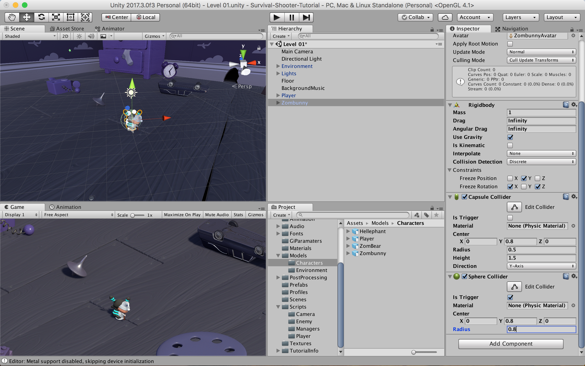

# 敵の実装
### ここでは，プレイヤーを襲う敵を実装する

"Assets > Models > Characters" 内の "Zombunny" を "Hierarchy" にドロップ


"Zombunny" を選択し，"Inspector" 内の "Layer" を "Shootable" に変更する


"Yes, change children" を選択


"Zombunny" に "Add Component" で "Rigidbody"を追加<br>
プロパティは以下のように設定する


同様に "Capsule Collider" を追加し，プロパティを以下のように設定


"Sphere Collider" を追加し，以下のように設定


"Audio Source" を追加し，以下のように設定


"Nav Mesh Agent" を追加し，以下のように設定<br>
"Nav Mesh Agent" を用いて，プレイヤーを追う敵の動きを実装する<br>
"Nav Mesh Agent" についての詳細は以下のリンクへ
### [Nav Mesh Agent](https://docs.unity3d.com/ja/2017.3/Manual/nav-CreateNavMeshAgent.html)


"Window > Navigation" を開く


"Navigation" ウィンドウの "Bake" タブを選択


以下のように設定する


"Bake" をクリックし，"Nav Mesh" を生成


"Animation" フォルダ内で "Create > Animator Controller" を選択<br>
"EnemyAC" とする


"EnemyAC" を "Zombunny" にドロップする


"EnemyAC" をダブルクリックで開き，"Assets > Models > Characters" 内の<br>
"Zombunny" から "Idle"，"Move"，"Death" を "Animator" ウィンドウにドロップ<br>
このとき，"Move" がオレンジ色でなければ，"Move" を右クリックでデフォルトステートにする


"Make Transition" で以下のように矢印を結ぶ


"PlayerDead" と "Dead" という "Trigger Parameter" を作成


"Move → Idle" の "Contidion" を "PlayerDead" に設定


"Any State → Death" の "Contidion" を "Dead" に設定<br>
このアニメーションウィンドウ内のステートの関係が意味するのは，<br>
**"PlayerDead" が "False" ならば，"Move" の状態でプレイヤーを追いかけ，逆に "True" になると，"Idle" 状態になる。"Dead" が "True" になると "Death" 状態になる**
<br>
ということである


"Assets > Script > Enemy" フォルダから "EnemyMovement" を "Zombunny" へドロップ


"EnemyMovement" を確認してみる
```
using UnityEngine;
using System.Collections;

public class EnemyMovement : MonoBehaviour {
  // 変数の宣言
  Transform player;
  // PlayerHealth playerHealth;
  // EnemyHealth enemyHealth;
  UnityEngine.AI.NavMeshAgent nav;

  /*
   * Awake はゲームが始まる前に呼び出される
   * ここでは変数の初期化のために使用
   */
  void Awake () {
    /*
     * player という変数にゲームオブジェクトの "Player" の "transform" を入れる
     * "transform" はそのゲームオブジェクトの位置，回転，スケールを扱うことができる
     */
    player = GameObject.FindGameObjectWithTag ("Player").transform;

    // playerHealth という変数にゲームオブジェクト "Player" の "PlayerHealth" を入れる
    // playerHealth = player.GetComponent <PlayerHealth> ();

    // enmeyHealth という変数にコンポーネント "enemyHealth" を入れる
    // enemyHealth = GetComponent <EnemyHealth> ();

    // nav という変数にコンポーネント "NavMeshAgent" を入れる
    nav = GetComponent <UnityEngine.AI.NavMeshAgent> ();
  }

  /*
   * Update はフレーム毎に呼び出される
   * ここでは変数の更新のために使用
   */
  void Update () {
    /* 
     * 敵とプレイヤーの体力がどちらも0より大きいのであれば，
     * 敵が向かう座標をプレイヤーがいる位置に設定する
     * それ以外であれば，コンポーネントを無効にして更新をやめる
     */
    // if(/*enemyHealth.currentHealth > 0 &&*/ playerHealth.currentHealth > 0) {
      nav.SetDestination (player.position);
    // }
    // else {
    //   nav.enabled = false;
    // }
  }
}
```

テストプレイしてみて，プレイヤーの移動に敵がついてくるようになれば，問題ない<br>
このとき，"Player" の "Inspector" 内の "Tag" が "Player" になっているかどうかに注意
